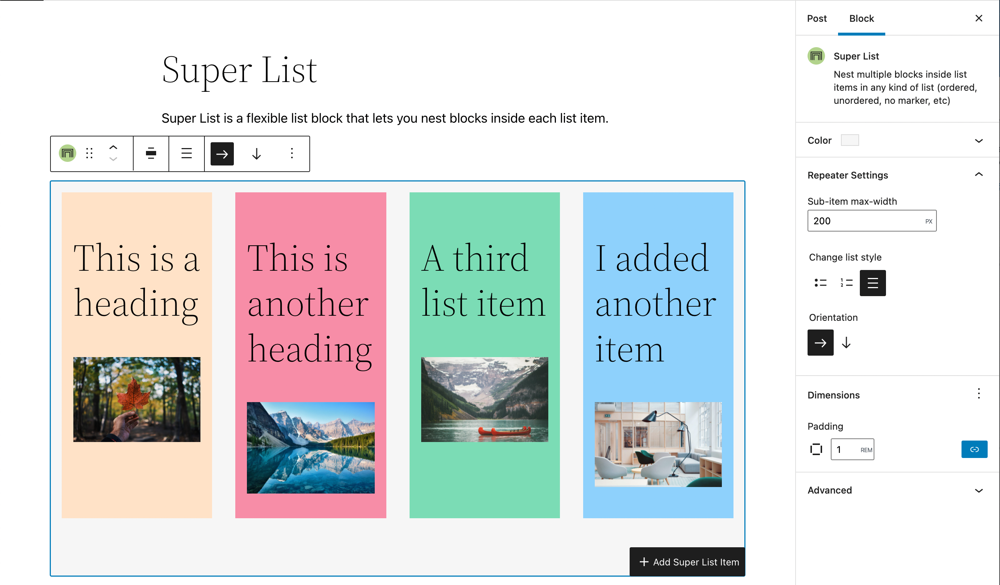
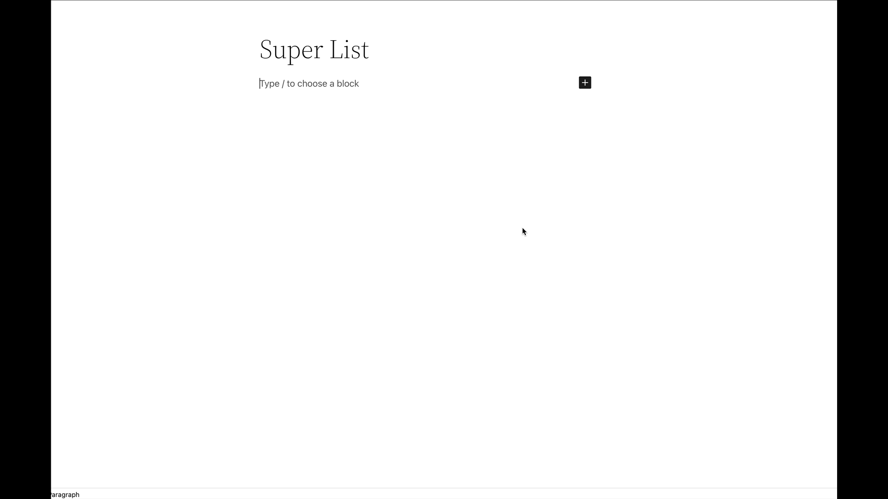
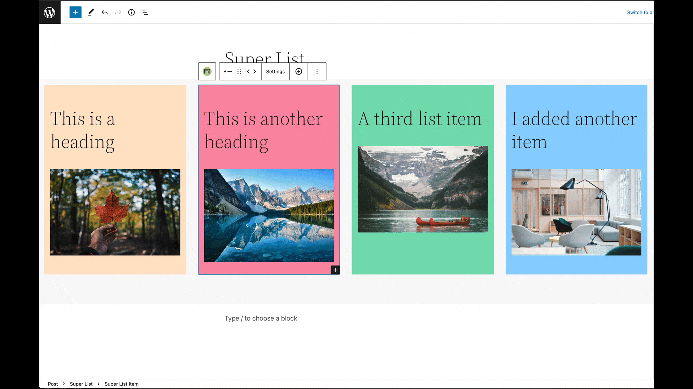

# Super List Block

Nest multiple blocks inside lists of any kind of list (ordered, unordered, no marker, etc), or do away with list markers and use it like a repeater!

_Super List is open for contributions! If you would like to contribute to the project, please check out the [Contributing Guide](CONTRIBUTING.md)._

## Description

A handy little block that can be used in a variety of ways. Use it to nest other blocks inside list items, to create simple grid layouts ( like a properly responsive pricing table, or a wrapping icon list), or other use cases I haven't yet thought of!

This block is very light on styles (and avoids unnecessary div soup!). It aims to provide you with as much flexibility as possible, so you can harness it to create the content structure and layout you like.

If you enjoy the block, please leave a review! ⭐

If you have a feature request, please create an issue in the [GitHub repository](https://github.com/createwithrani/superlist). ➕

If you need support, please use the support forum to reach out. 🆘

## Key Features

* Nest blocks inside ordered and unordered lists.
* Nest blocks inside lists without any markers.
* Let's you create single column content or grid like content with the horizontal orientation setting.
* Supports native color, padding, and margin settings. 🎉
* Has a handy `add` button in the toolbar of list items to easily add more items while you're in the flow.
* Exposes the inner inserter with a clear text label for easy insertion.
* Built entirely native WordPress Block Editor components
* There is a pro version coming with even more features!

## Requirements

- WordPress 5.9+
- PHP 7.0+

## Contributors
Alongside Aurooba, other folks are always welcome to contribute since this _is_ an open source project. Contributors to this project:
[@aurooba](https://github.com/aurooba)
[@cr0ybot](https://github.com/cr0ybot)

## Screenshots

## Sponsors
A big thank you to the lovely [sponsors](https://aurooba.com/sponsors) who help me make more time for open source contributions like this one!
